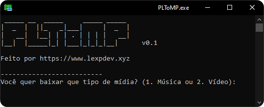
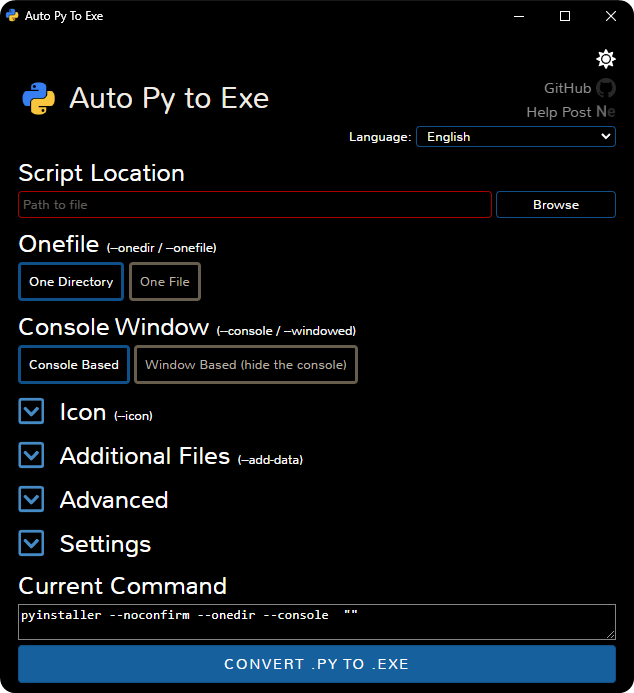
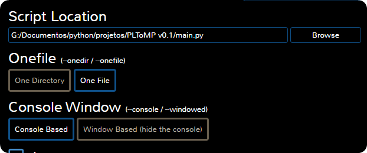
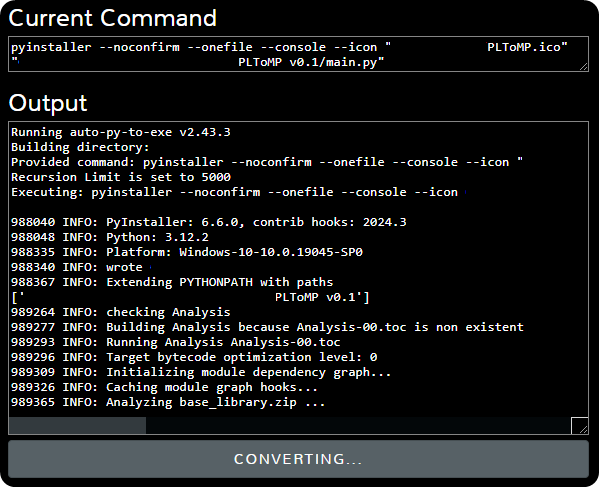

# PLToMP
Um baixador de playlists do youtube feito em python.



# Como baixar
Apenas vá na aba de Releases e baixe alguma delas :) *(um dia terá uma build para linux!!)*

# Como compilar

## Requisitos
- Python 3 ou superior instalado
- Acesso ao pip *(no windows normalmente você instala selecionando a opção Add to PATH na instalação)*
- Windows 7 ou superior
## Preparação
Baixe o repositório em zip e extraia, e após isso, instale as blibiotecas necessárias digitando o comando ```pip install pytube unidecode re os auto-py-to-exe moviepy``` no CMD. (caso você tenha um metodo melhor para compilar, por favor, me avise!!).

Após isso, digite o comando ```auto-py-to-exe``` no CMD ou na sua IDE favorita que irá abrir uma tela mais ou menos assim:



Na opção Path to File, coloque o local do script do PLToMP, que provavelmente será main.py, e caso queira um arquivo executavel só, selecione OneFile.
As opções devem estar assim:



Caso queira, na aba Icon, coloque [o .ico do PLToMP](img/PLToMP.ico) ou o ícone da sua preferência (caso você queira, você pode criar o seu próprio icone!)

Após isso, você pode clicar no botão Convert .PY to .EXE, que ele fará o processo automáticamente.



Ao terminar de compilar, você pode clicar no botão Open output folder para abrir a pasta que o .exe foi colocado


